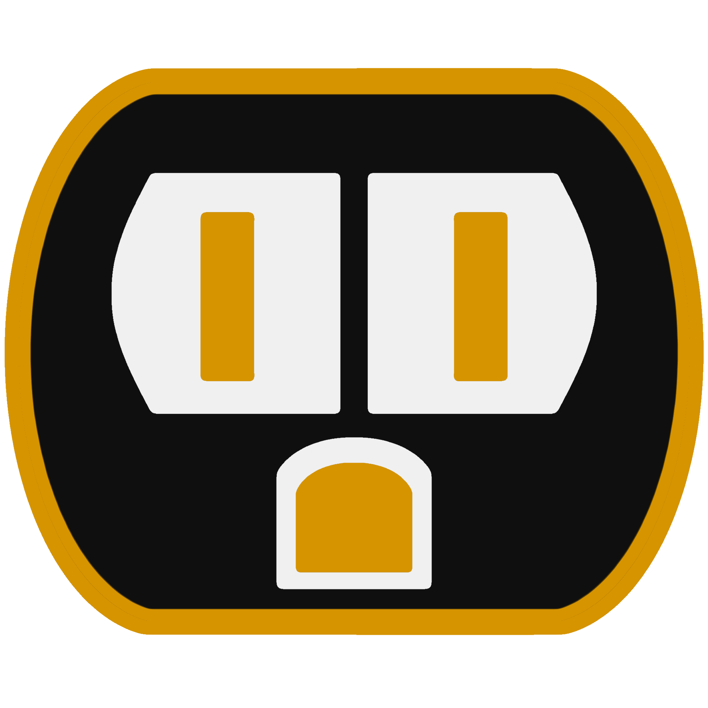

    <h1>Socket</h1>
    
A macro manager plugin for Roblox

	
	 
	
<a href="https://joelbrd.github.io/Socket/">View Documentation</a>

	 
	<h2>Contributing</h2>
	
Interested in contributing? You can! Socket accepts new PRs and filing Issues. Check out the contribution section on the docs c:

